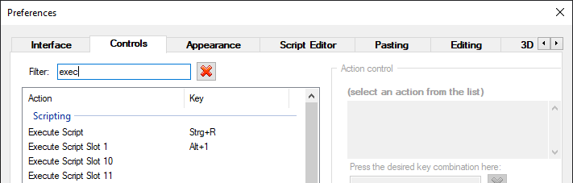
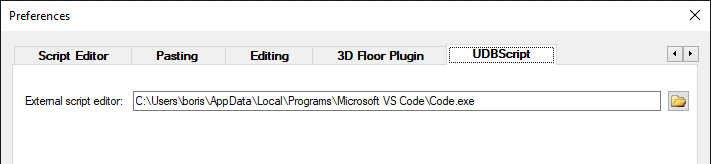
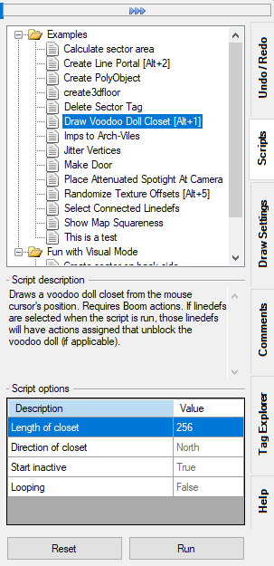
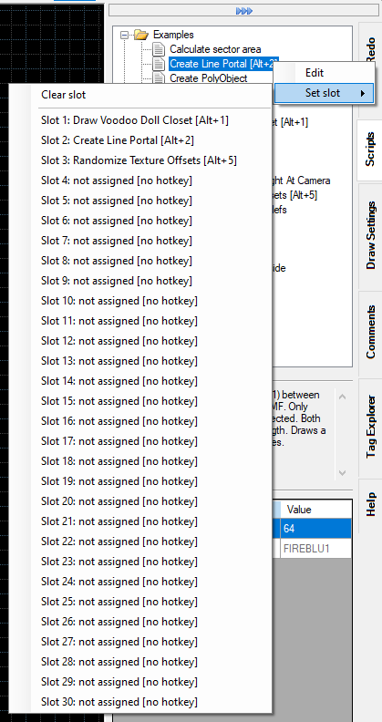
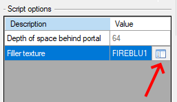
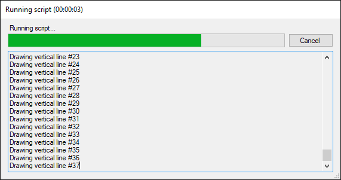

# Getting started

## Introduction

UDBScript allows the user to run custom JavaScript code on the currently opened map. This allowes the user to modify existing map elements (like things or sectors), or to create completely new map elements (i.e. drawing lines, adding things etc.).

This guide only shows the intricacies of UDBScript and doesn't teach JavaScript. If you need a JavaScript tutorial please use your favourite search engine. UDBScript also comes with a variety of well-documented example scripts to study.

UDBScript uses the [Jint](https://github.com/sebastienros/jint) interpreter.

## Directory structure

Scripts are automatically found if they are placed in the correct directory structure. The directory structure is in the UDB installation folder and looks like this:

```
.\UDBScript\
.\UDBScript\Libraries\
.\UDBScript\Scripts\
```

All files ending on .js in the `Libraries` directory are loaded (parsed and executed) every time a script is run. It is used to provide common functionality to multiple script. Currently there's the Pen.js library file that simplifies drawing geometry (it's inspired by the DBX Lua Pen class).

All files ending on .js in the `Scripts` directory (and its subdirectories) are added to the Scripts docker. They are only run on the user's command.

!!! tip
	UDBScript does hot reloading, i.e. changes to the scripts, or copying new scripts into the directory structure will be shown immediately.

!!! warning
	UDBScript comes with multiple example scripts in the `.\UDBScript\Scripts\Examples` directory. Do not modify those scripts, since they will be overwritten when UDB is updated. If you want to use one of the example scripts as a bas copy it to another directory!

## Setting hotkeys to execute scripts

Hotkeys to execute scripts can be set by going to `Tools` -> `Preferences` -> `Controls`, and then filtering by `execute`.

You can set a hotkey to "Execute Script", which will execute the currently selected script in the docker (see [The docker](#the-docker)), or up to 30 hotkeys to the "Execute Script Slot *x*", which will execute the script in the corrosponding slots (see [The docker](#the-docker)).



## Setting up an external script editor

It is possible to set up an external script editor to edit the script from within UDB. To do so you have to open the preferences and go to the UDBScript tab (you probably have to scroll the tabs). It defaults to notepad.exe, but it's recommended to set it to an editor that supports syntax highlighting.



## The docker

Scripts can be accessed, configured, and run through the provided docker. Selecting a script will show it's description (if available) and configuration options. 

Default values in the script options will be shown in gray, deviating values as black. Pressing the `Reset` button will reset all values to their defaults. 

Scripts can either be run using the `Run` button, or by pressing the assigned key (see [Setting hotkeys to execute scripts](#setting-hotkeys-to-execute-scripts)). Note that scripts might rely on the mouse cursor being somewhere in the map space, in which case they will not run correctly using the `Run` button. This should be intercepted by the script.



You can open a context menu for each script by right-clicking on it. In the context menu you can either chose to edit the script, or to assign the script to one of the script slots. Assigning the script to a script slot allows you to execute the script by pressing the hotkey you assigned to the script slot (see [Setting hotkeys to execute scripts](#setting-hotkeys-to-execute-scripts)).



## Writing scripts

### Script metadata

Scripts can contain metadata at the top of the file to provide information about the script as well as available script options. The metadata is specified as JavaScript template strings, i.e. strings enclosed by backticks (`` ` ``). The template string has to start with a `#`, followed by a command, followed by the payload, followed by a `;`.

!!! attention
    The template string **has** to be followed by a `;`. All script metadata has to be at the top of the file and may not be interrupted by any other constructs (like variable declaraion or assignment). If such constructs are detected parsing of the metadata will stop.

Example:
```js
`#version 2`;

`#name Super Useful Script`;

`#description This script does something really, really useful.`;
```

Currently the following metadata commands are available:

- `version`: the feature version the script needs to run. Properties and methods that require a specific version are noted as such in the API documentation. If omitted version 1 is assumed. If the script requires a higher feature version than the user's UDBScript feature version the user will be asked if they want to execute the script anyway. If the user choses to execute the script this choice will be remembered for the session
- `name`: name of the script that will be shown in the docker. If omitted the capitalized file name without the extension will be used as the script name
- `description`: description of the script. Should include what the script does and what the requirements are (for example if something has to be selected for the script to work)
- `scriptoptions`: the script options. The payload has to be in UDB's configuration file format (see below)

!!! attention
    It is highliy recommended to set the feature version through the `version` metadata command. The global `UDB` namespace was added in version 4, and new features will be exclusively added to this namespace!

#### Setting script options

The script options that can be set in the docker prior to running the script can be defined using the `scriptoptions` metadata command. The payload has to be in UDB's configuration file format.

The payload consists of one or more blocks, each defining an option. The blocks have the following format:

```js
`#scriptoptions

<name>
{
    description = <description>;
    default = <defaultvalue>;
    type = <type>;
    enumvalues {
        <values>
    }
}
`;
```
!!! note
    - The `eunumvalues` field is only used with the appropriate `type` value

Example:

```js
`#scriptoptions

length
{
	description = "Length of closet";
	default = 256;
	type = 0; // Integer
}

direction
{
	description = "Direction of closet";
	default = 0; // North
	type = 11; // Enum
	enumvalues {
		0 = "North";
		1 = "East";
		2 = "South";
		3 = "West";
	}
}
`;
```

You can also write the options in a more compact form:

```js
`#scriptoptions

width  { description = "Width of the sector";  type = 0; default = 256; }
height { description = "Height of the sector"; type = 0; default = 512; }
`;
```

The following types are currently available:

- 0: integer
- 1: floating point number
- 2: string
- 3: boolean
- 5: sector effect*
- 6: texture*
- 7: flat*
- 8: angle in degrees*
- 9: angle in radians*
- 10: color*
- 11: enumeration**
- 13: sector tag*
- 14: thing tag*
- 15: linedef tag*
- 17: angle in degrees as floating point number*
- 18: thing type*
- 19: thing class*
- 22: byte angle*
- 25: PolyObject number*

&ast; these are quality of life type for interger, floating point numbers, and strings. Clicking into their field will show context sensitive controls. For example when using type 3 (boolean) there will be drop down list where you can choose between `true` or `false`, when using type 6 (texture) a button button that will open the texture browser, when using type 13 (sector tag) will show a drop down list of sector tags in the map etc.<br>

#### Accessing script options in a script

The script option can be accessed through the `ScriptOptions` object in the global `UDB` namespace. This object has properties by the name of the blocks of the script option definition, and contains the value set in the docker.

Example:

```js
`#scriptoptions

length
{
	description = "Length of closet";
	default = 256;
	type = 0; // Integer
}
`;

UDB.showMessage('The given length is ' + UDB.ScriptOptions.length);
```
!!! tip
    You can also query options at runtime. See the `QueryOptions` API documentation.

### The global UDB namespace

Starting with feature version 4 of UDBScript all objects, methods, and classes are combined in the global `UDB` namespace. This is to prevent clashes with existing and future features of Javascript (for example Javascript has a [Map](https://developer.mozilla.org/en-US/docs/Web/JavaScript/Reference/Global_Objects/Map) class). It is highly recommended to specify the feature version through the `version` metadata command (see above). New UDBScript features will only be added to the global `UDB` namespace.

In practice that means that all methods, objects, and classes have to be prefixed with `UDB.`, for example getting all sectors in a map looked like this in versions prior to 4:
```js
let sectors = Map.getSectors();
```
while in version 4 and later the following code has to be used:
```js
let sectors = UDB.Map.getSectors();
```

### Working with vectors

In UDBScript vectors are commonly used to represent positions, like thing and vertex positions. They come in two flavors, `Vector2D` (representing a two-dimentional vector with `x` and `y` components) and `Vector3D` (representing a three-dimentional vector with `x`, `y`, and `z` components). They feature a range of vector math methods, such as rotating the vector.

There are several ways to create a new vector:

```js
let v1 = new UDB.Vector2D(32, 64); // From x and y values
let v2 = new UDB.Vector2D([ 32, 64 ]); // From an array with two numbers
let v3 = new UDB.Vector2D({ x: 32, y: 64 }); // From an object with x and y properties
let v4 = new UDB.Vector2D(v1); // From another Vector2D

let v5 = new UDB.Vector3D(32, 64, 16); // From x, y, and z values
let v6 = new UDB.Vector3D([ 32, 64, 16 ]); // From an array with three numbers
let v7 = new UDB.Vector3D({ x: 32, y: 64, z: 16 }); // From an object with x, y, and z properties
let v8 = new UDB.Vector3D(v5); // From another Vector3D
```

API methods that accept a `Vector2D` or `Vector3D` as a parameter also accept the array notation. For example the following lines are equivalent:

```js
let t1 = UDB.Map.createThing(new UDB.Vector2D(32, 64), 3001); // Create an Imp
let t2 = UDB.Map.createThing([ 32, 64 ], 3001); // Create an Imp
let t3 = UDB.Map.createThing({ x: 32, y: 64 }, 3001); // Create an Imp

let v = new UDB.Vector2D(32, 64); // Supplying the x and y values
let t4 = UDB.Map.createThing(v, 3001); // Create an Imp
```

#### Vector arithmetic

It is possible to do elementary arithmetic with vectors, i.e. you can add, substract, multiply, and divide them.

```js
let v1 = new UDB.Vector2D(2, 3) + new UDB.Vector2D(4, 5); // Results in new Vector(6, 8)
let v2 = new UDB.Vector2D(2, 3) - new UDB.Vector2D(4, 5); // Results in new Vector(-2, -2)
let v3 = new UDB.Vector2D(2, 3) * new UDB.Vector2D(4, 5); // Results in new Vector(8, 15)
let v4 = new UDB.Vector2D(2, 3) / new UDB.Vector2D(4, 5); // Results in new Vector(0.5, 0.6)
```

This also works with the array and object notation:

```js
let v1 = new UDB.Vector2D(2, 3) + [ 4, 5 ]; // Results in new Vector(6, 8)
let v2 = new UDB.Vector2D(2, 3) + { x: 4, y: 5 }; // Results in new Vector(6, 8)
```

You can also use only a number as one side of the operation, in  which case the operation will be applied to each element of the vector:

```js
let v1 = new UDB.Vector2D(2, 3) + 3; // Results in new Vector(5, 6)
let v2 = new UDB.Vector2D(2, 3) * 3; // Results in new Vector(6, 9)
```

!!! attention
    Vector arithmetic only works if either side of arithmetic operation is of type `Vector2D` or `Vector3D`. That means that for example the following code will *not* result in a vector:<br>
	`let v1 = [ 2, 3 ] + [ 4, 5 ]; // Results in the string "2, 34, 5"`

### Working with map elements

Map elements (things, sectors, linedefs, sidedefs, vertices) can be accessed through the `UDB.Map` object. This object has methods that return an array of map elements, for example `UDB.Map.getSectors()` returns an array of `Sector` objects, which are are all sectors in the map. There are also methods to get all selected (for example `UDB.Map.getSelectedSectors()`) and marked (for example `UDB.Map.getMarkedSectors()`), or the currently highlighted (for example `UDB.Map.getHighlightedSector()`) map elements. There are also methods to get either the currently selected map elements, *or* the currently highlighted map elements (for example `UDB.Map.getSelectedOrHighlightedSectors()`). These map elements can then be modified, see the documentation for the particular map element type in the API section.

!!! note
    "Marking" a map element is a way to denote that something happened to this map element. For example when using the `UDB.Map.drawLines()` method all new geometry will be marked.

!!! info
    UDB differentiates between "selecting" and "highlighting" map elements. "Selecting" means clicking on the map element, "highlighting" means just hovering the mouse on (or near) a map element. All the `UDB.Map.getSelectedOrHighlighted...()` methods behave like UDB usually works, i.e. if at least one map element is selected, the selected map elements will be returned (and the highlighted map element will be ignored), if no map elements are selected the highlighted map element will be returned.
	In most circumstances it is recommended to use the `UDB.Map.getSelectedOrHighlighted...()` to stay close to UDB's built-in actions.

### Creating new geometry

New map geometry can be created with the `drawLines()` method of the `UDB.Map` object. It accepts an array of coordinates in map space. The coordinates can either by instances of `Vector2D`, `Vector3D`, or an array of numbers.

Example 1:

```js
UDB.Map.drawLines([
	new UDB.Vector2D(0, 0),
	new UDB.Vector2D(64, 0),
	new UDB.Vector2D(64, 64),
	new UDB.Vector2D(0, 64),
	new UDB.Vector2D(0, 0)
]);
```

Example 2:

```js
UDB.Map.drawLines([
	[ 0, 0 ],
	[ 64, 0 ],
	[ 64, 64 ],
	[ 0, 64 ],
	[ 0, 0 ]
]);
```

Both examples are equivalent. The advantage of using `Vector2D` or `Vector3D` is that they have many math related methods built-in.

Another method to draw geometry is using the `Pen` class - which itself is implemented as a library written in JavaScript. It's inspired by the DoomBuilder X class of the same name. It provides some quality of life features, since it creates coordinates relative to the current position - just like moving a pen around a sheet of paper, or [Turtle graphics](https://en.wikipedia.org/wiki/Turtle_graphics).

Naive implementation of the above example using the `Pen` class:

```js
let p = new Pen();
p.moveTo([0, 0]);
p.drawVertex();
p.moveTo([64, 0]);
p.drawVertex();
p.moveTo([64, 64]);
p.drawVertex();
p.moveTo([0, 64]);
p.drawVertex();
p.finishDrawing();
```

Using the strenghts of the `Pen` class:

```js
let p = new Pen([0, 0]);

for(let i=0; i < 4; i++)
{
	p.drawVertex();
	p.moveForward(64);
	p.turnRight();
}

p.finishDrawing();
```

### Ending scripts prematurely

Normally a script ends when the last instruction is executed. But there can be situations where you want to end a script early.

- `UDB.exit()`: this global function ends the script with success. It can optionally take a string argument that is shown in the status bar upon ending the script
- `UDB.die()`: this global function ends the script with a failure. This means that it will undo any changes the script has made. It can optionally take a string argument that is shown in the status bar upon ending the script
- `throw`: throws an exception. Only ends the script if it's not caught in a `try`/`catch` block. If not caught it'll end the script with a failure. This means that it will undo any changes the script has made. The string given as a parameter is shown in the status bar upon ending the script

```js
let sectors = UDB.Map.getSelectedSectors();

if(sectors.length == 0)
	UDB.die('You have to select at least one sector');

UDB.exit('There were ' + sectors.length + ' sectors selected');

throw 'This part of the script should never be reached!';
```

### Communicating with the user

Sometimes you might want to let the script directly communicate with the user. To do that there are two functions, `UDB.showMessage()` and `UDB.showMessageYesNo()`.

- `UDB.showMessage()`: shows a message box with an "OK" button and the text given as the parameter<br>
```js
UDB.showMessage('Hello, world!');
```
- `UDB.showMessageYesNo()`: shows a message box with an "Yes" and "No" button and the text given as the parameter. Returns `true` if the "Yes" button was clicked, and `false` if the "No" button was clicked
```js
if(UDB.showMessageYesNo('Are you sure you want to replace all imps with Arch-Viles? That\'s not remotely fair!'))
{
	UDB.Map.getThings().filter(t => t.type == 3001).forEach(t => t.type=64);
}
```
For long-running scripts it's also possible to report the progress to the user using the `UDB.setProgress()` method, which accepts values from 0 to 100. For example the following code will set the progress bar to 25%:

```js
UDB.setProgress(25);
```

Additional output can be shown using the `UDB.log()` method, which will add a line of text to the log in the running script dialog:

```js
UDB.log('Hello, world!');
```

