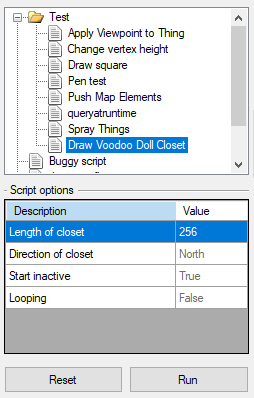

# UDB Scripting
## Introduction
Scripting is one of the big features UDB is missing. This branch is trying to rectify this.

It uses the [Jint](https://github.com/sebastienros/jint) interpreter to let the users execute their own JavaScript (ECMAScript 5.1, with some 6.0 features) scripts in the editor.
Since it exposes the whole UDB API (including those of the loaded plugins) to the scripting engine, much of what required a dedicated plugin can now be done with scripts.

## How it works
### Directory structure
Scripts are automatically found if they are placed in the correct directory structure. The directory structure is in the UDB installation folder and looks like this:

```
.\UDBScript\
.\UDBScript\Libraries\
.\UDBScript\Scripts\
```

All files ending on .js in the Libraries directory are loaded (parsed and executed) every time a script is run. It is used to provide common functionality to multiple script. Currently there's the Pen.js library file that simplifies drawing geometry (it's inspired by the DBX Lua Pen class).

All files ending on .js in the Scripts directory (and its subdirectories) are added to the Scripts docker. They are only run on the user's command. Scripts can optionally have a configuration file with the same name, just ending on .cfg.

### Script configuration files

The optional script configuration files can be used to let the user set script options before running the script. The configuration files look like this:

```
name = "Draw Voodoo Doll Closet";

options
{
	length
	{
		description = "Length of closet";
		default = 256;
		type = 0; // Integer
	}
	
	direction
	{
		description = "Direction of closet";
		default = "North";
		type = 11; // Enum
		enumvalues {
			0 = "North";
			1 = "East";
			2 = "South";
			3 = "West";
		}
	}
	
	inactive
	{
		description = "Start inactive";
		default = "True";
		type = 3; // Boolean
	}
	
	looping
	{
		description = "Looping";
		default = "False";
		type = 3; // Boolean
	}
}
```

### The docker




## Known issues and quirks

### Exposing Assemblies also exposes the System namespace
Scripts have access to the whole CLR, including Syste.IO and System.Net. [This is intentional behavior in Jint](https://github.com/sebastienros/jint/issues/222). This isn't a problem per se, since plugins could do the same. It'd be nice to blacklist certain namespaces, though, which isn't possible.

It *is* possible to remove the System namespace retroactively on the C# side:

```cs
engine.Global.RemoveOwnProperty("System");
```

This, however, it's really feasible, since parts of the namespace (for example System.Collection.Generic) are required for certain things to work, for example Tool.DrawLines takes an IList as an argument, passing an array from a script to it does not work.

### Setting array values doesn't work
This is a [known issue in Jint that won't be changed](https://github.com/sebastienros/jint/issues/776). This means that it's not possible to set a thing's or linedef's arguments by accessing the Args property:

```js
var t = UDB.General.Map.Map.CreateThing();
t.Args[0] = 123; // Won't work, it'll stay at 0
```
A workaround would be to implement a setter method the the args on the C# side:

```cs
public void SetArg(int num, int val)
{
    if(num >= 0 && num < args.Length)
        args[num] = val;
}
```

The downside is that this setter is likely to stay, even if the issue gets fixed in Jint (which seems unlikely), since simply removing it will break scripts that use it. It could be tried to later deprecate it, with spilling out error messages telling the user to update their scripts.

Another options is to replace the `args` array with an class that acts like an array, like this:

```cs
public sealed class MapElementArguments : IEnumerable<int>
{
	private int[] data;

	public MapElementArguments(int numargs)
	{
		data = new int[numargs];
	}

	public MapElementArguments(int numargs, IEnumerable<int> newdata) : this(numargs)
	{
		int i = 0;

		foreach(int d in newdata)
		{
			if (i < numargs)
				data[i] = d;

			i++;
		}
	}

	public int this[int i]
	{
		get { return data[i]; }
		set { data[i] = value; }
	}

	public int Length { get { return data.Length; } }

	public IEnumerator<int> GetEnumerator()
	{
		foreach(int i in data)
			yield return i;
	}

	IEnumerator IEnumerable.GetEnumerator()
	{
		return GetEnumerator();
	}

	public MapElementArguments Clone()
	{
		return new MapElementArguments(data.Length, data);
	}
}
```
This works mostly transparent, with few changes to the rest of the code.

### ECMAScript Array can't be passed to methods that take List<> as a parameter
The good news is that you can create instances of List<> objects. It's rather unwieldy, though. To get the equivalent to C#

```cs
List<Linedef> linedefs = new List<Linedef>();
```

in the script you have to write

```js
var linedefs = new (System.Collections.Generic.List(UDB.Map.Linedef))();
```

A helper function could be created, for example

```js
function MakeList(cls)
{
    return new (System.Collections.Generic.List(cls))();
}

var linedefs = MakeList(UDB.Map.Linedef);
```

Another options would be to add a library that extends the Array prototype like this:

```js
Array.prototype.ToList = function(cls)
{
	var list = new (System.Collections.Generic.List(cls))();
	
	this.forEach(e => {
		list.Add(e);
	});
	
	return list;
}
```

which could then be called liks this:

```js
var myarray = [];

UDB.General.Map.Map.Things.forEach(t => { myarray.push(t); });

var mylist = myarray.ToList(UDB.Map.Thing);
```


### Iterating over LinkedList
It's cumbersome. It's not possible to use neat methods like `forEach` or `filter` on them. You have to iterate over them using their `First` and `Next` properties. I don't think they are used widely, it mostly seems to affects the  `Sidedefs` property of the `Sector` class, and the `Linedefs` property of the `Vertex` class.

Ways to iterate over `LinkedList`:

```js
function LinkedListToArray(linkedlist)
{
	var array = [];
	
	for(var it=linkedlist.First; it != null; it = it.Next)
		array.push(it.Value);

	return array;	
}
```
or
```js
function LinkedListToArray(linkedlist)
{
	var array = [];
	
	var enumerator = linkedlist.GetEnumerator();
	
	while(enumerator.MoveNext())
		array.push(enumerator.Current);
	
	return array;	
}
```

### ECMAScript doesn't have operator overloading
This is only a minor nuisance. An example where this comes into play is when working with Vector2D or Vector3D. Doing basic math operations like addition or multiplication on them doesn't work, instead a new instance has to be created with the desired values:

```js
var Vector2D = UDB.Geometry.Vector2D;

var v1 = new Vector2D(1, 1);
var v2 = new Vector2D(2, 2);

var v3 = v1 + v2; // Doesn't work, results in v3 being the string "1, 12, 2"

var v4 = new Vector2D(v1.x + v2.x, v1.y + v2.y); // You have to do this
```

### Lack of documentation
There's no API documentation. Since the scripts directly access the UDB API doing an documentation seems futile. It's probably a better idea to go through the source files that are most relevant for scripting, add triple-slash-comments where needed and automatically generate a documentation with something like [DocFX](https://dotnet.github.io/docfx/). Having a FAQ and well-commented example scripts would also help.

## Possible future improvements
- Update the script file tree when files are added to the directory structure at runtime
- Add option to open the script file and configuration file in an external editor through the context menu
- Add option to set favorite scripts
- Add multiple actions to run user-defined scripts